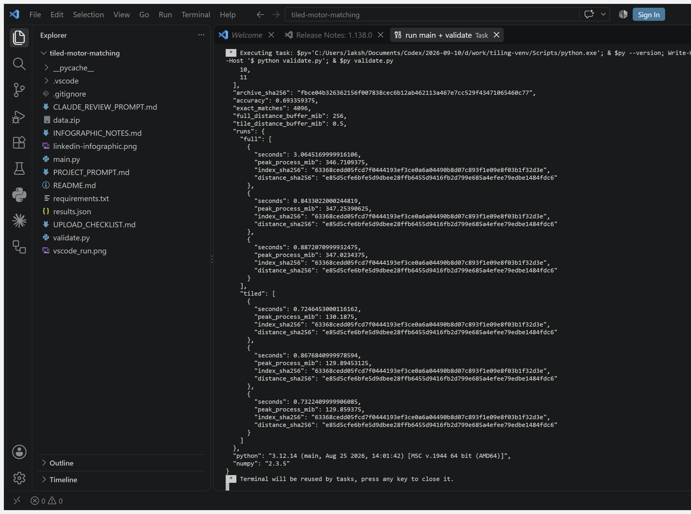
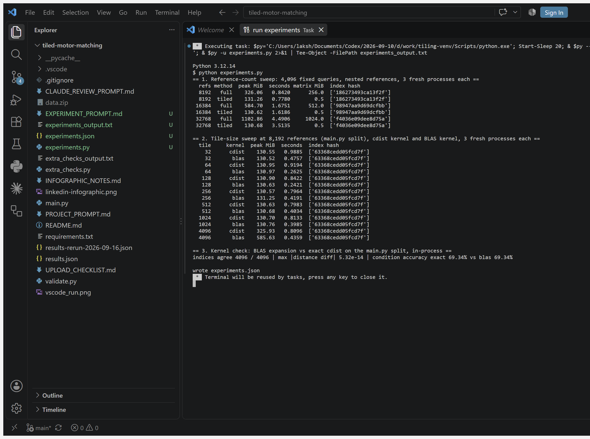

# Tiled motor-condition matching in 49 lines

An industrial maintenance analyst needs to find reference motor-current records similar to a new observation. Storing every query-to-reference distance can consume substantial memory. This offline Python prototype computes exact nearest references in blocks and discards each block after reducing it.

**Complete runnable example: [main.py](main.py), 49 physical lines.** Tests and measurement tooling are separate and are not included in that count. NumPy and SciPy provide the numerical kernels.

## Measured result

4,096 query records × 8,192 reference records × 48 features, float64, tile size 256; Windows, Python 3.12.14, NumPy 2.3.5, SciPy 1.18.1. Three fresh processes per method; elapsed times cover distance computation and nearest-match reduction, excluding download and preprocessing.

| Measurement | Full distance matrix | Tiled + immediate reduction |
|---|---:|---:|
| Largest individual distance buffer, calculated | 256 MiB | 0.5 MiB |
| Median peak process working set, measured | 348.48 MiB | 131.51 MiB |
| Median compute time, measured | 0.7794 s | 0.7806 s |
| Nearest-reference answers agreeing with baseline | 4,096 / 4,096 | 4,096 / 4,096 |



The individual distance buffer is 512× smaller. Total measured process memory decreased about 62.3%; **512× is not the total-memory improvement**. Python assignment can transiently retain an old tile while constructing the next one. Inputs, loading, scaling, copies, interpreter and library allocations also consume memory. Peak working set covers the entire child process. Where that peak comes from matters: in the tiled process the ~130 MiB peak is reached while loading and deduplicating the table, before `nearest()` runs, and the tiled search never rose above that floor (**+0.00 MiB** in four fresh-process probes). The full-matrix search raised the same process from ~130 MiB to ~347 MiB (**+217 MiB**: the 256 MiB matrix on top of the ~91 MiB the process holds once the loaded table is freed). So the 62% figure depends on how much memory the loader uses on this machine; the search-step difference is 256 MiB of buffer versus no measurable increase. See [extra_checks_output.txt](extra_checks_output.txt). There is no demonstrated speed improvement.

### Reproduction, 2026-09-16

Two re-runs on the same machine and the same pinned environment, after the measurement above:

| Run | Full matrix | Tiled + reduction | Peak-memory reduction |
|---|---:|---:|---:|
| Clean terminal re-run ([results-rerun-2026-09-16.json](results-rerun-2026-09-16.json)) | 347.25 MiB, 0.7829 s | 129.89 MiB, 0.7864 s | 62.6% |
| VS Code task run, captured in [vscode_run.png](vscode_run.png) | 347.02 MiB, 0.8872 s | 129.89 MiB, 0.7322 s | 62.6% |

All six subprocesses in both re-runs produced the same index and distance SHA-256 as the original run. The VS Code run fired while the editor itself was still starting; its first full-matrix timing (3.06 s) is a cold-start outlier, so no timing conclusion is drawn from that run. The memory result and the absence of a speedup held in every run.

## Run the complete example

Use Python 3.12 in a fresh environment:

```bash
python -m venv .venv
# Windows PowerShell:
.venv\Scripts\Activate.ps1
# macOS/Linux instead: source .venv/bin/activate
python -m pip install -r requirements.txt
python main.py
```

The first execution downloads the official UCI archive into `data.zip`. Subsequent runs reuse it. Expected output:

```text
Queries: 4096 | References: 8192
Exploratory condition accuracy: 69.34%
Distance buffers: full 256.0 MiB; tile 0.5 MiB
```

On Windows, run `python validate.py` to regenerate [results.json](results.json). The validator uses Windows `peak_wset`; the minimal example itself is cross-platform. Run the validator from this directory. Allow several hundred MiB of RAM for the full-matrix comparison.

## Second pass, 2026-09-16: from one point to a curve

[EXPERIMENT_PROMPT.md](EXPERIMENT_PROMPT.md) sets three questions a reviewer would ask of the table above; [experiments.py](experiments.py) answers them. Every number below is from [experiments_output.txt](experiments_output.txt) / [experiments.json](experiments.json), produced by the run captured in [vscode_experiments.png](vscode_experiments.png) (same pinned environment, three fresh Windows processes per cell, medians). A first terminal run of the same script is kept as [experiments_output_run1.txt](experiments_output_run1.txt).



### 1. Does the memory gap grow with the reference count?

Prediction as written in EXPERIMENT_PROMPT.md: full-matrix peak grows by ~256 MiB per doubling; tiled peak stays at the data-loading floor. 4,096 fixed query rows (their standardized vectors shift slightly with each reference set, since scaling is fit on references), nested reference sets, tile 256, `cdist` kernel.

| References | Matrix size | Full matrix peak | Tiled peak | Full time | Tiled time |
|---:|---:|---:|---:|---:|---:|
| 8,192 | 256 MiB | 326.06 MiB | 131.26 MiB | 0.8420 s | 0.7780 s |
| 16,384 | 512 MiB | 584.70 MiB | 130.62 MiB | 1.6751 s | 1.6186 s |
| 32,768 | 1,024 MiB | 1,102.86 MiB | 130.68 MiB | 4.4906 s | 3.5135 s |

The first half of the prediction was wrong as stated: the matrix doubles each step, so the increments were 258.6 MiB and then 518.2 MiB, not a constant 256 MiB. The corrected prediction, one extra matrix per doubling, held; the tiled half held as written, never leaving the ~131 MiB loading floor. At 32,768 references the tiled search was 1.28× faster, and the first run showed the same gap (5.6826 s vs 4.4861 s, 1.27×); the likely cause is the 1 GiB matrix's page faults and the separate `argmin` pass over it, which was not isolated, so it is reported, not claimed. The 326 MiB full-matrix peak here versus 348 MiB in the first table is harness overhead: on the identical computation and split, `validate.py`'s child process peaks 347.4–347.5 MiB and `experiments.py`'s 325.9–326.1 MiB ([experiments_threads_and_harness.txt](experiments_threads_and_harness.txt)); the cause of the ~21 MiB difference was not isolated. Both methods gave identical index hashes at every size. Note the split here differs from `main.py` (queries are rows 32,768–36,863 of the shuffled table, so that the same queries face every reference set), which is why the 8,192-reference hash differs from `results.json`.

### 2. Was tile size 256 justified?

Sweep at 8,192 references on the `main.py` split. Every cell reproduced the `results.json` index hash (`63368ced…`).

| Tile | `cdist` kernel time | `cdist` peak | BLAS kernel time | BLAS peak |
|---:|---:|---:|---:|---:|
| 32 | 0.9885 s | 130.55 MiB | 0.4757 s | 130.52 MiB |
| 64 | 0.9194 s | 130.95 MiB | 0.2625 s | 130.97 MiB |
| 128 | 0.8422 s | 130.90 MiB | **0.2421 s** | 130.63 MiB |
| 256 | **0.7964 s** | 130.57 MiB | 0.4191 s | 131.25 MiB |
| 512 | 0.7983 s | 130.63 MiB | 0.4034 s | 130.68 MiB |
| 1,024 | 0.8133 s | 130.70 MiB | 0.3985 s | 130.76 MiB |
| 4,096 | 0.8096 s | 325.93 MiB | 0.4359 s | 585.63 MiB |

For the `cdist` kernel, tile size barely matters between 128 and 4,096 (0.80–0.84 s); only very small tiles pay per-call overhead (32 → 0.99 s). 256 was a reasonable inherited choice, and in this run the best; in the first run tiles 4,096 and 128 were marginally faster (0.7869 s and 0.7882 s vs 0.8111 s), so 128–4,096 is one plateau. Memory is flat until the tile reaches the query count, at which point tile 4,096 × 8,192 references is half the full matrix (128 MiB buffer → 326 MiB peak). The BLAS kernel at tile 4,096 is worse still (585.63 MiB): the expansion formula materialises several 128 MiB temporaries, so a large tile with that kernel uses more memory than the full `cdist` matrix. Tiling granularity matters for memory only near the top; for speed it matters only at the bottom.

### 3. Is "no speedup" about tiling, or about the kernel?

About the kernel. Both original methods call `scipy.spatial.distance.cdist`. Replacing it inside the *same* tile loop with the BLAS expansion ‖q‖² + ‖r‖² − 2·q·rᵀ (a matrix multiply) gives 0.2421 s at tile 128 against 0.7964 s for the best `cdist` tile, **3.3× faster with the same ~131 MiB peak**; at tile 256 it is 0.4191 s (1.9×). OpenBLAS 0.3.30 uses 8 threads by default while `cdist` is single-threaded, so the thread count was ruled out: pinned to `OPENBLAS_NUM_THREADS=1`, the tile-128 BLAS kernel took 0.197 / 0.216 / 0.330 s against 0.956 / 0.978 / 1.006 s for `cdist` in the same session ([experiments_threads_and_harness.txt](experiments_threads_and_harness.txt)). A 128×48 by 48×128 product is too small for threads to help; the 8-thread runs in that session were slower (0.576–0.662 s). The gain is the kernel, not parallelism. BLAS timings are noisier than `cdist` timings across runs (tile 128 individual runs in the sweep: 0.220–0.434 s), so the ratio is "about 3×", not a fixed number. The first terminal run put the best BLAS tile at 64 (0.2391 s) with 128 close behind (0.2541 s); the 64–128 range is the sweet spot on this CPU, and the ranking between those two is within run-to-run noise. The expansion formula is numerically weaker (cancellation for near-identical rows), so agreement was checked: **4,096 / 4,096 indices identical** to the exact search, largest distance discrepancy 5.32e-14, condition accuracy unchanged at 69.34%. The BLAS *distances* are not bit-stable: tile 128 with 8 threads produced a different distance hash (`4ffd85cb…`) from every other tile size and from the single-thread run (`c824f7c2…`), last-bit differences from summation order. Indices were identical in every cell, which is what the search returns. The speed comes from the kernel, not from tiling; the memory result comes from tiling, not from the kernel. `main.py` keeps the `cdist` kernel because it is the exact, readable one; `nearest_blas` lives in `experiments.py`.

## What the book contributed, and what changed

Source: Chao Wang, *Domain-Specific Computer Architectures for Emerging Applications: Machine Learning and Neural Networks*, CRC Press, 2024. Algorithm 5.2, also labeled “Algorithm 2 Tiled Distance Calculation Algorithm,” printed pp. 136–138; supplied PDF pages 76–77. [Book DOI](https://doi.org/10.1201/9780429355080).

The book describes object and centroid blocks for FPGA data reuse and outputs the full distance array. This independently written CPU implementation applies two-axis tiling to query and reference records. **Immediate nearest-match reduction is an additional adaptation:** tiling alone would not remove the full output array. Partial final tiles and deterministic first-index ties are handled. Work remains O(NMD); retained output is O(N), with bounded tile distance storage. These are CPU measurements, not measurements of FPGA transfers, energy, or acceleration.

## Dataset and evaluation limits

[UCI Dataset for Sensorless Drive Diagnosis](https://archive.ics.uci.edu/dataset/325/dataset+for+sensorless+drive+diagnosis), Bator, M. (2013), [DOI 10.24432/C5VP5F](https://doi.org/10.24432/C5VP5F), CC BY 4.0. Original data are not bundled. The archive SHA-256 is recorded in results.json.

Audit: 58,509 rows, 48 numerical features plus one condition label, 11 classes, all values finite, zero exact duplicate rows. The example sorts/deduplicates rows, shuffles with seed 42, selects 8,192 references and 4,096 disjoint queries, then standardizes using reference means and standard deviations only. The remaining records are unused. Selection is random, not stratified.

Nearest-reference condition-label accuracy is **69.34%**. Baselines on the same split: **majority class 9.38%** (11 near-balanced conditions, so this equals chance) and **nearest centroid 50.76%**. Per-class recall ranges from 55.7% (condition 5) to 99.7% (condition 11); conditions 7 and 11 are near-perfect, the other nine sit between 56% and 75%. Across six shuffle seeds (42, 0–4) 1-NN accuracy spans 69.34%–71.19%, mean 70.39%; seed 42, the published split, is the lowest. All from [extra_checks_output.txt](extra_checks_output.txt). Exact agreement with the full distance algorithm does not mean correct diagnosis. Row-wise splitting may put correlated measurements in both partitions; the downloaded table has no explicit machine/run grouping used here. This is not evidence of generalization to unseen motors or operating runs. Before deployment, use run/machine-separated evaluation, condition-level error analysis, stronger diagnostic baselines and domain validation. No measured downtime reduction, cost saving or autonomous maintenance recommendation is claimed.

## Correctness evidence

14 edge/correctness cases cover an independent direct-subtraction distance oracle, partial tiles, tile sizes 1/4/32, empty queries, singleton inputs, equal-distance ties, nonfinite inputs, mismatched dimensions, empty references and invalid tile size. Additionally, all 4,096 real-data nearest indices and distances match the full SciPy calculation exactly. Output hashes agree across all six benchmark processes. See [validate.py](validate.py) and [results.json](results.json). [extra_checks.py](extra_checks.py) (added 2026-09-16) adds a second oracle using the expansion ‖q‖²+‖r‖²−2q·r (all 4,096 indices agree, distances within 5.3e-14), confirms bit-identical results for tile sizes 37, 1000, 4095, 5000 and 100000 on the real data, confirms zero rows shared between query and reference, and reports the baselines, per-class recall, seed spread and fresh-process memory probes quoted above; its output is in [extra_checks_output.txt](extra_checks_output.txt).

## Review and attribution

See [CLAUDE_REVIEW_PROMPT.md](CLAUDE_REVIEW_PROMPT.md) before publishing. [PROJECT_PROMPT.md](PROJECT_PROMPT.md) records the project specification. No book PDF, credentials, local environments or fabricated execution screenshots should be uploaded. This repository contains an educational adaptation, not the author's original implementation.
